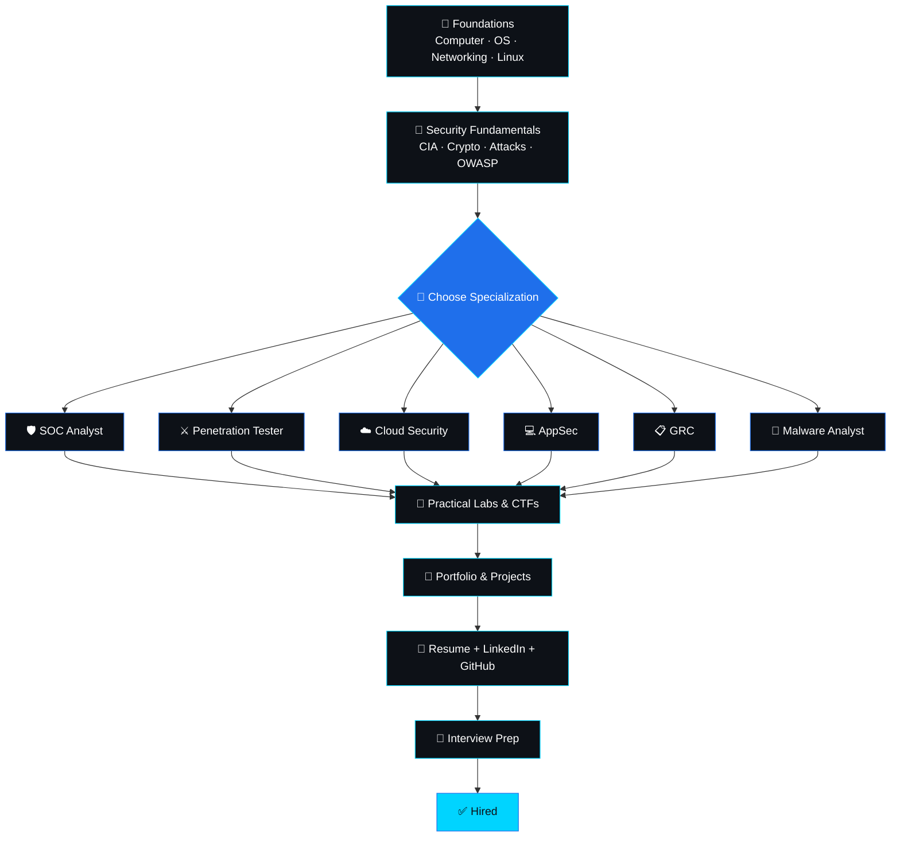
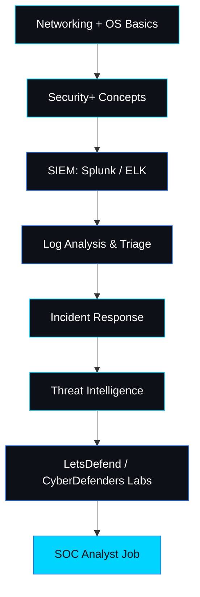
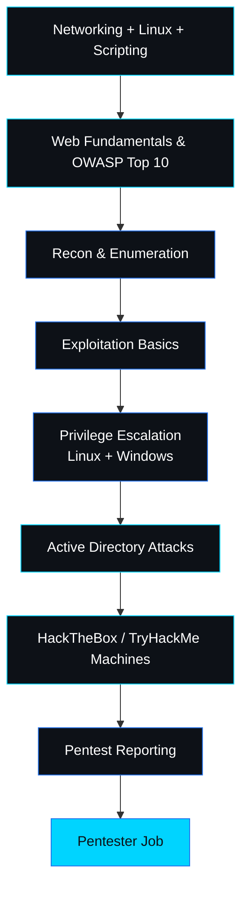
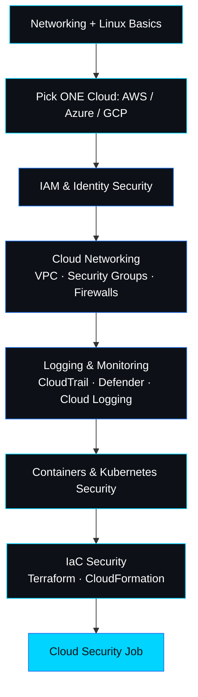
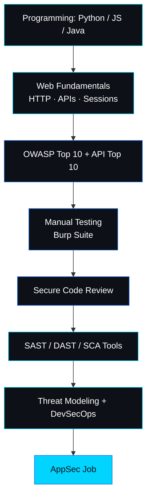
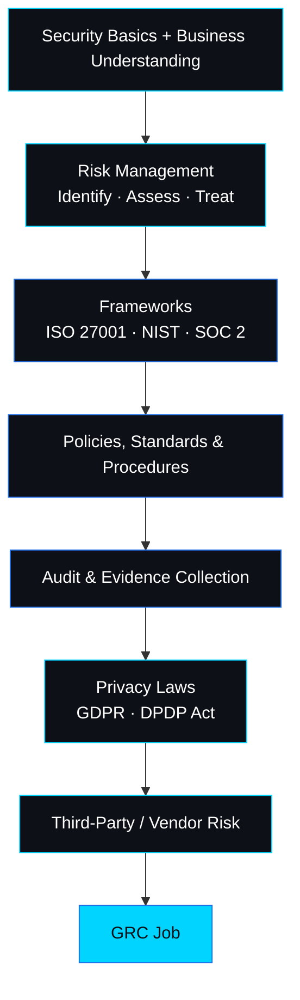
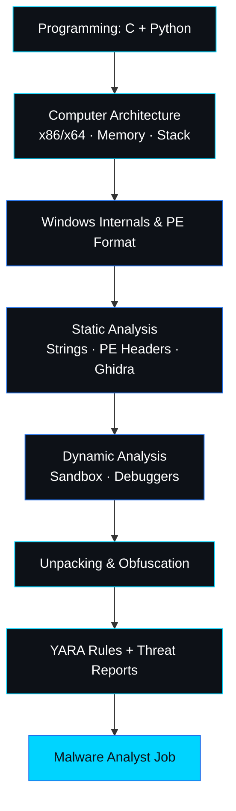

<!-- Suggested repo description: Free cybersecurity roadmap for beginners — from zero to job-ready. Role-based paths, labs, certs & a 90-day plan. By Bugitrix. -->
<!-- Suggested topics: cybersecurity, roadmap, beginner, infosec, pentesting, soc-analyst, cyber-security-roadmap, learning-path, ctf, blue-team, red-team, cloud-security, appsec, grc, bugitrix -->

<div align="center">


<a href="https://bugitrix.com">
  
</a>

<br/>

[](https://opensource.org/licenses/MIT)
[](https://github.com/bugitrix/cybersecurity-roadmap/stargazers)
[](https://github.com/bugitrix/cybersecurity-roadmap/network/members)
[](https://github.com/bugitrix/cybersecurity-roadmap/graphs/contributors)
[](https://github.com/bugitrix/cybersecurity-roadmap/commits/main)
[](https://github.com/bugitrix/cybersecurity-roadmap/pulls)

[](https://bugitrix.com)
[](mailto:Info@bugitrix.com)
[](https://t.me/bugitrix)

</div>


## 🧭 What Is This Repo?

Welcome to the **Bugitrix Cybersecurity Roadmap** — a free, open-source, visual **cybersecurity roadmap for beginners**. If you've ever felt lost in the ocean of free content, scattered tutorials, and conflicting advice, this repo is your anchor. It takes you from *"I don't know where to start"* to *"I'm career-ready"* in one clear, structured path.

This is not another link dump. It's a **cybersecurity learning path** built around four core stages: **Foundations, Security Fundamentals, Specialization, and Practical Job Readiness.** Every stage tells you:

- ✅ **What to learn**
- 🛠️ **What tools to practice**
- 🆓 **Which free resources to use**
- 🚦 **Exactly when you're ready to move forward**

Whether you want to become a **SOC Analyst**, a **Penetration Tester**, or break into **Cloud Security**, **AppSec**, **GRC**, or **Malware Analysis**, this roadmap gives you the full picture — and the next step. It is **free forever**, open-source, and maintained by the mentor-first team at **Bugitrix**.

> ⭐ **Star this repo if it helps you.** It helps more beginners find it — and it tells us to keep improving it.

### 👤 Who Is This For?

| You are… | This roadmap helps you… |
|---|---|
| A complete beginner | Get a clear starting point with zero prior knowledge |
| A student (BCA / BTech / BSc / any stream) | Turn college time into job-ready skills |
| An IT professional (helpdesk, sysadmin, dev) | Switch into security without starting over |
| A career changer | Pick a role that matches your background and strengths |
| Self-taught and stuck | Get structure, milestones, and a portfolio plan |

### 🧩 How to Use This Roadmap

1. **Read** [The Big Picture](#-the-big-picture-roadmap) once — don't try to learn it all at once.
2. **Start at Stage 1** and only move forward when you pass the *"You're ready when…"* check.
3. **Pick one specialization** in Stage 3 and follow its role-based roadmap.
4. **Track progress** with the [Progress Checklist](#-progress-checklist).
5. **Follow the [30-60-90 Day Plan](#-30-60-90-day-action-plan)** to stay consistent.


## 📚 Table of Contents

- [What Is This Repo?](#-what-is-this-repo)
- [The Big Picture Roadmap](#-the-big-picture-roadmap)
- [The 4 Core Stages (Detailed)](#-the-4-core-stages-detailed)
  - [Stage 1 — Foundations](#-stage-1--foundations-weeks-14)
  - [Stage 2 — Security Fundamentals](#-stage-2--security-fundamentals-weeks-510)
  - [Stage 3 — Choose Your Specialization](#-stage-3--choose-your-specialization-weeks-1120)
  - [Stage 4 — Practical + Job Ready](#-stage-4--practical--job-ready-weeks-2132)
- [Role-Based Roadmaps](#-role-based-roadmaps)
  - [SOC Analyst (Blue Team)](#-soc-analyst-blue-team-roadmap)
  - [Penetration Tester (Red Team)](#-penetration-tester-red-team-roadmap)
  - [Cloud Security](#-cloud-security-roadmap)
  - [Application Security (AppSec)](#-application-security-appsec-roadmap)
  - [GRC / Compliance](#-grc--compliance-roadmap)
  - [Malware Analyst / Reverse Engineer](#-malware-analyst--reverse-engineer-roadmap)
- [Recommended Certifications](#-recommended-certifications)
- [Build Your Home Lab](#-build-your-home-lab)
- [Free Learning Resources](#-free-learning-resources)
- [Progress Checklist](#-progress-checklist)
- [Common Beginner Mistakes](#-common-beginner-mistakes)
- [30-60-90 Day Action Plan](#-30-60-90-day-action-plan)
- [FAQ](#-faq)
- [Legal & Ethical Use](#-legal--ethical-use)
- [How Bugitrix Can Help](#-how-bugitrix-can-help)
- [Contributing](#-contributing)
- [License](#-license)
- [Connect With Bugitrix](#-connect-with-bugitrix)


## 🗺️ The Big Picture Roadmap

Here is the entire **cybersecurity career path** in one view. Don't panic — you only ever need to focus on the next stage.



### ⏱️ Timeline at a Glance

| Stage | Duration | Focus | Outcome |
|---|---|---|---|
| 🧱 Stage 1 | Weeks 1–4 | Foundations | Comfortable with OS, networking, Linux, VMs |
| 🔐 Stage 2 | Weeks 5–10 | Security Fundamentals | Understand attacks, defenses, OWASP Top 10 |
| 🎯 Stage 3 | Weeks 11–20 | Specialization | Deep skills in one chosen path |
| 🚀 Stage 4 | Weeks 21–32 | Practical + Job Ready | Portfolio, cert, resume, interview-ready |

> 💡 **Timelines are a guide, not a rule.** With 8–10 focused hours a week, ~8 months is realistic. Study full-time and you can move faster. Life busy? Go slower — just don't stop.


## 🧱 The 4 Core Stages (Detailed)

### 🧱 Stage 1 — Foundations (Weeks 1–4)

**Goal:** Build the technical base that every cybersecurity career sits on. Skip this and everything later feels like magic — and magic doesn't get you hired.

**What to learn:**
- Computer basics: CPU, RAM, storage, BIOS/UEFI, boot process
- Operating system fundamentals: processes, memory, file systems, permissions
- Networking essentials: OSI model, TCP/IP, subnetting, DNS, DHCP, HTTP/HTTPS, ports & protocols
- Linux command line: navigation, file permissions, users & groups, package management
- Windows basics: Registry, services, Event Logs, PowerShell basics
- Virtual machines: install and run Kali Linux + a vulnerable target VM
- Basic troubleshooting: reading logs, checking connectivity (`ping`, `traceroute`, `netstat`, `ss`)
- Intro scripting: Bash and Python basics (variables, loops, functions, files)

**Tools to practice:**
- VirtualBox or VMware Workstation Player
- Kali Linux, Ubuntu Server
- Wireshark (basic packet capture)
- `nmap` (host discovery only — keep it legal)
- Windows Event Viewer
- VS Code + Git basics

**Free resources:**
- [Cisco Networking Academy — Networking Basics](https://www.netacad.com/)
- [Professor Messer — Network+ (free videos)](https://www.professormesser.com/)
- [OverTheWire: Bandit](https://overthewire.org/wargames/bandit/) — Linux CLI practice
- [TryHackMe — Pre Security Path](https://tryhackme.com/path/outline/presecurity)

**🚦 You're ready for the next stage when…**
You can explain the OSI model, set up a VM, navigate Linux without a GUI, write a small Bash/Python script, and capture traffic in Wireshark without panicking.

> 🎯 **Want a personalized study plan for these 4 weeks?** Bugitrix's **1:1 Cybersecurity Clarity Session (₹999)** maps this stage to your schedule and goals. → [Book here](https://bugitrix.com)

---

### 🔐 Stage 2 — Security Fundamentals (Weeks 5–10)

**Goal:** Understand how systems break, why they break, and how defenders think.

**What to learn:**
- The CIA Triad: Confidentiality, Integrity, Availability
- Cryptography basics: symmetric vs asymmetric, hashing, digital signatures, PKI, TLS
- Authentication & authorization: MFA, SSO, OAuth/OIDC basics, least privilege
- Network security devices: firewalls, IDS/IPS, VPNs, proxies, WAF
- Common attacks: phishing, MITM, SQL injection, XSS, CSRF, privilege escalation, brute force
- OWASP Top 10 — the most critical web application risks
- Threat modelling basics and the MITRE ATT&CK framework
- Incident response basics: preparation, detection, containment, eradication, recovery, lessons learned
- Security frameworks: NIST CSF, ISO 27001 (high-level)

**Tools to practice:**
- Burp Suite Community Edition
- OWASP ZAP
- Wireshark (deeper analysis)
- `hydra`, `john the ripper` (in legal labs only)
- Splunk Free or Elastic Stack (log analysis)

**Free resources:**
- [OWASP Top 10](https://owasp.org/www-project-top-ten/)
- [PortSwigger Web Security Academy](https://portswigger.net/web-security) — free labs
- [TryHackMe — Cyber Security 101 Path](https://tryhackme.com/)
- [MITRE ATT&CK](https://attack.mitre.org/) — attacker tactics & techniques knowledge base
- [Professor Messer — Security+ (free videos)](https://www.professormesser.com/security-plus/sy0-701/sy0-701-video/sy0-701-comptia-security-plus-course/)

**🚦 You're ready for the next stage when…**
You can explain the OWASP Top 10, perform a basic web app test in a legal lab, map a simple attack to MITRE ATT&CK, and describe how a firewall differs from an IDS.

> 🎯 **Stuck on a concept like cryptography or SQLi?** A Bugitrix mentor can walk you through it in plain English. → [Explore Mentorship](https://bugitrix.com)

---

### 🎯 Stage 3 — Choose Your Specialization (Weeks 11–20)

**Goal:** Stop learning everything. Start going deep on one path that matches your personality, strengths, and career goals.

| Path | What You Do | Starter Cert | Beginner-Friendly? |
|---|---|---|---|
| **SOC Analyst (Blue Team)** | Monitor alerts, investigate incidents, triage threats, write reports | CompTIA Security+ | ✅ Very |
| **Penetration Tester (Red Team)** | Legally hack systems, find vulnerabilities, write pentest reports | eJPT → PNPT / OSCP | ✅ Yes (with labs) |
| **Cloud Security** | Secure AWS/Azure/GCP workloads, IAM, containers, cloud posture | AWS Security Specialty / AZ-500 | ⚠️ Some cloud basics needed |
| **Application Security (AppSec)** | Review code, test web/mobile apps, integrate security into CI/CD | CSSLP (later) | ✅ Yes (if you code) |
| **GRC / Compliance** | Build policies, assess risk, ensure ISO/SOC 2/GDPR compliance | ISO 27001 Lead Implementer / CISM (later) | ✅ Very (non-technical friendly) |
| **Malware Analyst / RE** | Dissect malware, reverse binaries, write threat intel reports | GREM (later) | ❌ Advanced (needs programming) |

**How to choose:**

| If you love… | Consider… |
|---|---|
| Investigating and writing | 🛡️ **SOC Analyst** |
| Breaking things (legally) | ⚔️ **Penetration Tester** |
| Cloud infrastructure | ☁️ **Cloud Security** |
| Code and secure design | 💻 **AppSec** |
| Policy, risk, and people | 📋 **GRC** |
| Low-level code and puzzles | 🧬 **Malware Analyst** |

> 💡 **Tip:** Try a 1-week "taster" of two paths (e.g., a SOC lab on LetsDefend and a web lab on PortSwigger) before committing. Your gut reaction tells you a lot.

> 🎯 **Not sure which path fits you?** That's exactly what the **Bugitrix Clarity Session (₹999)** is for. → [Book here](https://bugitrix.com)

---

### 🚀 Stage 4 — Practical + Job Ready (Weeks 21–32)

**Goal:** Turn knowledge into proof. Build a portfolio, earn a cert, and get interview-ready.

**What to do:**
- Build a home lab: pfSense, Windows AD, Linux servers, vulnerable VMs (see [Build Your Home Lab](#-build-your-home-lab))
- Complete 20+ CTF rooms/machines on TryHackMe or HackTheBox
- Build 3 portfolio projects (e.g., SIEM dashboard, pentest report, cloud security audit)
- Write clean write-ups and publish them on GitHub
- Optimize your resume for ATS and cybersecurity keywords
- Rebuild your LinkedIn: headline, about, featured projects, open-to-work
- Practice interviews: behavioral + technical + scenario-based
- Earn one entry-level cert: Security+, eJPT, or Google Cybersecurity Certificate

**Portfolio project ideas:**

| Track | Project Idea |
|---|---|
| SOC | Build a Splunk/ELK dashboard detecting brute-force and suspicious PowerShell |
| Pentest | Full pentest report on an intentionally vulnerable machine (executive summary + findings + remediation) |
| Cloud | Audit a sample AWS account for IAM misconfigurations and write a hardening guide |
| AppSec | Scan a vulnerable app with ZAP/Semgrep and document fixes for each finding |
| GRC | Draft an ISMS policy set and risk register for a fictional company |
| Malware | Analyse a sample in a sandbox and write an IOC-based threat report |

**Tools to practice:**
- TryHackMe, HackTheBox, LetsDefend, CyberDefenders
- GitHub (portfolio + write-ups)
- Notion or Obsidian (notes & lab documentation)
- Canva or Figma (clean report design)

**Free resources:**
- [TryHackMe — Complete Beginner Path](https://tryhackme.com/)
- [HackTheBox Academy](https://academy.hackthebox.com/)
- [LetsDefend — SOC Analyst Labs](https://letsdefend.io/)
- [CyberDefenders — Blue Team CTFs](https://cyberdefenders.org/)

**🚦 You're career-ready when…**
You have 3 portfolio projects, 1 cert, a clean resume, an active LinkedIn, and you can talk through a mock incident or pentest from start to finish.

> 🎯 **Need interview prep and portfolio feedback?** Bugitrix's **Cybersecurity Career Ready (₹3,999)** program is built for this exact stage. → [Learn more](https://bugitrix.com)


## 🛣️ Role-Based Roadmaps

Pick your path and follow the specific flowchart. Each one is a focused **cybersecurity roadmap** for that role.

### 🛡️ SOC Analyst (Blue Team) Roadmap

**What you'll do:** Monitor alerts, triage incidents, investigate suspicious activity, escalate threats, and document everything.



| Focus Area | Skills & Tools |
|---|---|
| Monitoring | Splunk, Elastic/ELK, Microsoft Sentinel, alert triage |
| Endpoint & Logs | Sysmon, Windows Event IDs, EDR concepts, Linux auth logs |
| Investigation | Wireshark, VirusTotal, URL/hash reputation, phishing analysis |
| Frameworks | MITRE ATT&CK, Cyber Kill Chain, NIST incident response |
| Reporting | Ticketing, incident reports, shift handovers |

**Start here:** [LetsDefend](https://letsdefend.io/) · [CyberDefenders](https://cyberdefenders.org/) · [TryHackMe SOC Level 1 Path](https://tryhackme.com/)

**Typical job titles:** SOC Analyst (L1/L2), Security Monitoring Analyst, Incident Response Analyst, Threat Detection Analyst

---

### ⚔️ Penetration Tester (Red Team) Roadmap

**What you'll do:** Legally simulate attacks, find vulnerabilities, prove impact, and write clear remediation reports.



| Focus Area | Skills & Tools |
|---|---|
| Recon & Scanning | Nmap, Gobuster/ffuf, Amass, Shodan (legal use only) |
| Web Testing | Burp Suite, SQLi, XSS, IDOR, SSRF, auth flaws |
| Exploitation | Metasploit (basics), manual exploitation, reverse shells |
| Post-Exploitation | Linux/Windows privilege escalation, pivoting basics |
| Active Directory | Kerberos, BloodHound, common AD misconfigurations |
| Reporting | Clear write-ups, risk ratings (CVSS), remediation advice |

**Start here:** [PortSwigger Academy](https://portswigger.net/web-security) · [HackTheBox](https://www.hackthebox.com/) · [TryHackMe Jr Penetration Tester Path](https://tryhackme.com/)

**Typical job titles:** Junior Penetration Tester, Security Consultant, Vulnerability Assessment Analyst, Red Team Associate

---

### ☁️ Cloud Security Roadmap

**What you'll do:** Secure cloud accounts, workloads, identities, and pipelines across AWS, Azure, or GCP.



| Focus Area | Skills & Tools |
|---|---|
| Identity | IAM policies, roles, least privilege, MFA, SSO |
| Posture | CSPM concepts, misconfiguration hunting, CIS Benchmarks |
| Workloads | Docker, Kubernetes basics, container image scanning |
| Automation | Terraform, Python/Bash, CI/CD security |
| Detection | CloudTrail, GuardDuty, Microsoft Defender for Cloud |

**Start here:** [Microsoft Learn](https://learn.microsoft.com/en-us/training/) · AWS Skill Builder (free tier content) · [flAWS.cloud](http://flaws.cloud/) · [TryHackMe Cloud Modules](https://tryhackme.com/)

**Typical job titles:** Cloud Security Engineer, Cloud Security Analyst, DevSecOps Engineer

---

### 💻 Application Security (AppSec) Roadmap

**What you'll do:** Find and fix vulnerabilities in code and applications, and build security into the software development lifecycle.



| Focus Area | Skills & Tools |
|---|---|
| Testing | Burp Suite, OWASP ZAP, API testing with Postman |
| Code Review | Reading code for injection, auth, and logic flaws |
| Automation | Semgrep, SonarQube, Snyk, Dependabot |
| Design | Threat modelling (STRIDE), secure design principles |
| Standards | OWASP ASVS, OWASP Cheat Sheets, SAMM |

**Start here:** [PortSwigger Academy](https://portswigger.net/web-security) · [OWASP Cheat Sheet Series](https://cheatsheetseries.owasp.org/) · [OWASP Juice Shop](https://owasp.org/www-project-juice-shop/)

**Typical job titles:** Application Security Engineer, Product Security Analyst, Secure Code Reviewer, DevSecOps Engineer

---

### 📋 GRC / Compliance Roadmap

**What you'll do:** Define policies, assess and manage risk, prepare for audits, and keep organizations compliant.



| Focus Area | Skills & Tools |
|---|---|
| Risk | Risk registers, risk assessment methods, business impact analysis |
| Frameworks | ISO/IEC 27001, NIST CSF, SOC 2, PCI DSS (overview) |
| Privacy | GDPR, India's DPDP Act (fundamentals) |
| Audit | Control testing, evidence gathering, gap analysis |
| Tools | Excel/Sheets, Jira, Vanta/Drata-style GRC platforms (concepts) |

**Start here:** [NIST Cybersecurity Framework](https://www.nist.gov/cyberframework) · ISO 27001 overview courses · [Cybrary](https://www.cybrary.it/)

**Typical job titles:** GRC Analyst, Compliance Analyst, Risk Analyst, IT Auditor, Information Security Analyst

---

### 🧬 Malware Analyst / Reverse Engineer Roadmap

**What you'll do:** Dissect malicious software, understand its behavior, extract indicators, and help defenders detect it.



| Focus Area | Skills & Tools |
|---|---|
| Static Analysis | Ghidra, PE-bear, strings, CFF Explorer |
| Dynamic Analysis | x64dbg, Procmon, Process Explorer, Any.Run / CAPE-style sandboxes |
| Detection | YARA, Sigma rules, IOC extraction |
| Reporting | Malware analysis reports, threat intelligence write-ups |

> ⚠️ **Safety first:** Only analyse malware inside an **isolated VM with no network access to your real devices**. Never run samples on your main machine.

**Start here:** [Ghidra](https://ghidra-sre.org/) · [MalwareTech](https://www.malwaretech.com/) · [Practical Malware Analysis (book)](https://nostarch.com/malware)

**Typical job titles:** Malware Analyst, Reverse Engineer, Threat Researcher, Detection Engineer


## 🎓 Recommended Certifications

> 💡 **Rule of thumb:** A cert opens the door. Skills and projects get you through it. Don't chase certs before you've built the basics.

### 🟢 Entry-Level (Start Here)

| Certification | Best For | Notes |
|---|---|---|
| **Google Cybersecurity Certificate** | Absolute beginners | Great for structure and confidence |
| **CompTIA Security+** | SOC, GRC, general security | Most recognised entry-level cert |
| **CompTIA Network+** | Networking foundation | Optional but very helpful |
| **eJPT** (INE) | Aspiring pentesters | Practical, hands-on exam |
| **ISC2 Certified in Cybersecurity (CC)** | Beginners / students | Entry-level, foundation-focused |

### 🟡 Intermediate

| Certification | Best For |
|---|---|
| **CompTIA CySA+** | SOC / blue team |
| **CompTIA PenTest+** | Pentesting fundamentals |
| **PNPT** (TCM Security) | Practical pentesting + AD |
| **BTL1** (Blue Team Labs) | Hands-on blue team |
| **AWS Security Specialty / Azure AZ-500** | Cloud security |
| **ISO 27001 Lead Implementer / Auditor** | GRC |

### 🔴 Advanced

| Certification | Best For |
|---|---|
| **OSCP** (OffSec) | Offensive security / pentesting |
| **CISSP** | Security leadership (needs experience) |
| **CISM / CISA** | Management, governance, audit |
| **CCSP** | Cloud security architecture |
| **GREM** | Malware analysis / reverse engineering |
| **CSSLP** | Secure software lifecycle |

> ⚠️ Exam formats, prices, and requirements change. **Always check the official certification page** before you plan or pay.


## 🧪 Build Your Home Lab

A home lab is the single best way to learn — and the best thing to show in an interview.

**Minimum setup (works on most laptops):**
- 8 GB RAM (16 GB recommended), ~100 GB free disk space
- VirtualBox or VMware Workstation Player
- Kali Linux VM (attacker) + a vulnerable target VM

**Lab ideas by level:**

| Level | Lab |
|---|---|
| 🟢 Beginner | Kali + Metasploitable / DVWA / OWASP Juice Shop |
| 🟡 Intermediate | pfSense firewall + segmented networks + Wireshark + Security Onion |
| 🔴 Advanced | Windows Server AD domain + Windows clients + Splunk/Wazuh SIEM + attack simulation |

**Practice targets:**
- [OWASP Juice Shop](https://owasp.org/www-project-juice-shop/)
- [DVWA](https://github.com/digininja/DVWA)
- [VulnHub](https://www.vulnhub.com/)
- [Wazuh](https://wazuh.com/) — free open-source SIEM/XDR
- [Security Onion](https://securityonionsolutions.com/) — free network monitoring platform

> 📝 **Document everything.** Screenshots, commands, findings, lessons — publish sanitized write-ups on GitHub or a blog.


## 📚 Free Learning Resources

### 🎥 YouTube Channels
- [Professor Messer](https://www.youtube.com/@professormesser) — Security+, Network+
- [John Hammond](https://www.youtube.com/@_JohnHammond) — CTFs, malware, practical
- [NetworkChuck](https://www.youtube.com/@NetworkChuck) — Beginner-friendly networking & security
- [The Cyber Mentor](https://www.youtube.com/@TCMSecurityAcademy) — Pentesting
- [IppSec](https://www.youtube.com/@ippsec) — HackTheBox walkthroughs

### 🧪 Hands-On Platforms
- [TryHackMe](https://tryhackme.com/) — Best for beginners
- [HackTheBox](https://www.hackthebox.com/) — Intermediate to advanced
- [PortSwigger Web Security Academy](https://portswigger.net/web-security) — Web app security
- [OverTheWire](https://overthewire.org/wargames/) — Linux & security wargames
- [PicoCTF](https://picoctf.org/) — Beginner CTFs
- [CyberDefenders](https://cyberdefenders.org/) — Blue team labs
- [LetsDefend](https://letsdefend.io/) — SOC analyst training

### 📚 Free Courses
- [Coursera — Google Cybersecurity Certificate](https://www.coursera.org/professional-certificates/google-cybersecurity)
- [Cybrary](https://www.cybrary.it/) — Free security courses
- [Cisco Networking Academy](https://www.netacad.com/) — Networking & security
- [Microsoft Learn](https://learn.microsoft.com/en-us/training/) — Azure & security

### 📖 Books (Beginner-Friendly)
- *CompTIA Security+ Get Certified Get Ahead* — Darril Gibson
- *The Web Application Hacker's Handbook* — Stuttard & Pinto
- *Linux Basics for Hackers* — OccupyTheWeb
- *Blue Team Handbook* — Don Murdoch
- *Practical Malware Analysis* — Sikorski & Honig *(advanced)*

### 🛠️ Tools to Master
- Wireshark, Nmap, Burp Suite, Metasploit
- Splunk, ELK Stack, Wazuh, Sysmon
- Kali Linux, VirtualBox, Docker
- Git & GitHub

### 🏆 CTF Platforms
- [PicoCTF](https://picoctf.org/)
- [HackTheBox](https://www.hackthebox.com/)
- [TryHackMe](https://tryhackme.com/)
- [CTFtime](https://ctftime.org/)

### 🧠 Reference Frameworks
- [MITRE ATT&CK](https://attack.mitre.org/)
- [OWASP Top 10](https://owasp.org/www-project-top-ten/)
- [NIST Cybersecurity Framework](https://www.nist.gov/cyberframework)
- [CIS Benchmarks](https://www.cisecurity.org/cis-benchmarks)


## ✅ Progress Checklist

Fork this repo and tick items off as you go (or copy this into your own notes).

**🧱 Stage 1 — Foundations**
- [ ] Explain the OSI model and TCP/IP in my own words
- [ ] Set up VirtualBox/VMware with Kali + a target VM
- [ ] Finish the first 10 levels of OverTheWire Bandit
- [ ] Capture and read traffic in Wireshark
- [ ] Complete TryHackMe Pre Security path

**🔐 Stage 2 — Security Fundamentals**
- [ ] Explain the CIA Triad, hashing, and TLS
- [ ] Understand the OWASP Top 10
- [ ] Solve 10+ PortSwigger Academy labs
- [ ] Complete TryHackMe Cyber Security 101
- [ ] Publish my first write-up

**🎯 Stage 3 — Specialization**
- [ ] Pick one role and commit for 10 weeks
- [ ] Complete 10+ labs in my chosen path
- [ ] Build my first mini-project

**🚀 Stage 4 — Job Ready**
- [ ] 3 portfolio projects on GitHub
- [ ] 1 entry-level certification
- [ ] Resume optimized for ATS
- [ ] LinkedIn rebuilt and active
- [ ] 3+ mock interviews completed
- [ ] Applying to jobs and internships weekly


## ❌ Common Beginner Mistakes

- ❌ **Tutorial hell** → ✅ Build something after every tutorial. If you can't, you didn't learn it.
- ❌ **Collecting 50 courses** → ✅ Finish one course, then practice. Depth > breadth.
- ❌ **Skipping networking** → ✅ Networking is the foundation of everything. Learn it properly.
- ❌ **Only watching, never doing** → ✅ 70% hands-on, 30% theory. Labs are non-negotiable.
- ❌ **Chasing certs without skills** → ✅ A cert opens doors; skills keep you in the room.
- ❌ **No portfolio** → ✅ 3 solid projects beat 10 certificates on a resume.
- ❌ **Learning illegal hacking first** → ✅ Master defense and legal labs before offense.
- ❌ **Ignoring soft skills** → ✅ Communication gets you hired. Report writing matters.
- ❌ **Comparing your Day 1 to someone's Year 5** → ✅ Run your own race. Consistency wins.
- ❌ **Quitting after 2 weeks** → ✅ Give it 90 days of focused effort. Then judge.
- ❌ **Skipping note-taking** → ✅ Document labs and commands. Your notes become your portfolio.


## 📅 30-60-90 Day Action Plan

| Phase | Focus | Milestones | Output |
|---|---|---|---|
| **Days 1–30** | Foundations | Networking basics, Linux CLI, 1 VM lab, TryHackMe Pre Security | Notes + 5 Bandit levels solved |
| **Days 31–60** | Security Fundamentals | OWASP Top 10, Burp Suite basics, 10 TryHackMe rooms | 2 write-ups + 1 web app lab report |
| **Days 61–90** | Specialization + Portfolio | Pick a path, complete 10 labs, build 1 project, update resume | 1 portfolio project + polished LinkedIn |

**Weekly rhythm that works:**

| Day | Activity |
|---|---|
| Mon–Thu | 1–2 hours: learn one concept + do one lab |
| Fri | Review notes, fix gaps, repeat weak topics |
| Sat | 2–3 hours: longer lab / CTF / project work |
| Sun | Write-up + plan next week |

> 🎯 **Want a personalized 30-60-90 plan with weekly check-ins?** Bugitrix's **8-Week Cybersecurity Career Program (₹9,999)** is built around this exact structure. → [Learn more](https://bugitrix.com)


## ❓ FAQ

<details>
<summary><b>Do I need to know coding to start in cybersecurity?</b></summary>

Not to start. Many roles (SOC, GRC) need little to no coding at first. Basic Python and Bash will help you a lot later, and AppSec and Malware Analysis require stronger programming skills.
</details>

<details>
<summary><b>Do I need a degree?</b></summary>

A degree helps in some hiring pipelines, but many employers value demonstrable skills, labs, certifications, and portfolios. Build proof of skill either way.
</details>

<details>
<summary><b>Which role is easiest to get into first?</b></summary>

SOC Analyst and GRC roles are commonly the most accessible entry points. Pentesting and Malware Analysis usually take longer and are more competitive at entry level.
</details>

<details>
<summary><b>How long will it take to get a job?</b></summary>

It depends on your starting point, time invested, and market conditions. Following this roadmap consistently, many learners aim for 6–12 months. There is no guaranteed timeline — consistency and proof of skill matter most.
</details>

<details>
<summary><b>Which certification should I get first?</b></summary>

For most beginners: **Security+** (general/blue team) or **eJPT** (pentesting). The Google Cybersecurity Certificate is a good confidence-builder if you're completely new.
</details>

<details>
<summary><b>Is TryHackMe or HackTheBox better for beginners?</b></summary>

Start with **TryHackMe** — its guided rooms are beginner-friendly. Move to **HackTheBox** when you're comfortable working independently.
</details>

<details>
<summary><b>Can I do this while studying or working full-time?</b></summary>

Yes. 8–10 focused hours a week is enough to make steady progress. It will take longer, but consistency beats intensity.
</details>

<details>
<summary><b>Is this roadmap really free?</b></summary>

Yes — free, open-source, and MIT-licensed. The paid Bugitrix services are optional; you can complete the entire roadmap without them.
</details>


## ⚖️ Legal & Ethical Use

Cybersecurity skills are powerful. Use them responsibly.

- ✅ **Only test systems you own or have explicit written permission to test.**
- ✅ Practice in legal labs: TryHackMe, HackTheBox, PortSwigger, your own home lab.
- ✅ Follow responsible disclosure and bug bounty program rules.
- ❌ Never attack, scan, or exploit real-world systems without authorization.
- ❌ Never run malware samples outside an isolated lab environment.

Unauthorized access to computer systems is illegal in most countries (e.g., under India's IT Act, the US CFAA, and the UK Computer Misuse Act). This repository is for **education and defensive/authorized security learning only**. The authors are not responsible for misuse.


## 🤝 How Bugitrix Can Help

This roadmap is free — and it always will be. But if you want a **personalized version** with a real mentor, here's how **Bugitrix** helps:

| Service | Price | Best For |
|---|---|---|
| 1:1 Cybersecurity Clarity Session | ₹999 | Complete beginners needing direction |
| 1:1 Cybersecurity Mentorship | ₹1,999 | Ongoing personal guidance |
| Cybersecurity Career Ready | ₹3,999 | Job-readiness & placement prep |
| 8-Week Cybersecurity Career Program | ₹9,999 | Structured transformation |
| Cybersecurity Career Accelerator | ₹15,000 | Fastest, premium full path |
| Practical Cybersecurity Projects | ₹1,999–₹4,999 | Real-world experience |
| Resume & LinkedIn Optimization | Custom | Getting interview calls |

> This roadmap is free. If you want a personalized version with a real mentor, here's how Bugitrix helps.

<div align="center">

[](https://bugitrix.com)
[](https://t.me/bugitrix)
[](mailto:Info@bugitrix.com)

</div>


## 🙌 Contributing

Found a great free resource? Open a PR! This roadmap gets better every time a learner shares what actually worked for them.

Please read our [CONTRIBUTING.md](CONTRIBUTING.md) for guidelines on adding resources, fixing links, or improving explanations. All contributions — big or small — are welcome.

**Ways to contribute:**
- Add a new free resource
- Fix a broken link
- Improve a stage explanation
- Add a new role roadmap
- Translate the roadmap
- Share your success story

**Quick start:**

```bash
# 1. Fork the repo, then clone your fork
git clone https://github.com/<your-username>/cybersecurity-roadmap.git
cd cybersecurity-roadmap

# 2. Create a branch
git checkout -b improve-stage-2

# 3. Make your changes, then commit
git add .
git commit -m "docs: improve Stage 2 resources"

# 4. Push and open a Pull Request
git push origin improve-stage-2
```

### 💙 Contributors

<a href="https://github.com/bugitrix/cybersecurity-roadmap/graphs/contributors">
  
</a>

### ⭐ Star History

<a href="https://star-history.com/#bugitrix/cybersecurity-roadmap&Date">
  
</a>


## 📄 License

This project is licensed under the **MIT License** — free to use, share, and fork. Attribution is appreciated but not required.

See [LICENSE](LICENSE) for full details.


## 🔗 Connect With Bugitrix

- 🌐 Website: [bugitrix.com](https://bugitrix.com)
- 📧 Email: [Info@bugitrix.com](mailto:Info@bugitrix.com)
- 💬 Telegram: [t.me/bugitrix](https://t.me/bugitrix)

<div align="center">


[](https://bugitrix.com)
[](mailto:Info@bugitrix.com)
[](https://t.me/bugitrix)

<br/>

**Made with ❤️ by [Bugitrix](https://bugitrix.com)**

*Your Cyber Security Career Starts Here*

⭐ **If this roadmap helped you, please star the repo and share it with a friend.** ⭐

</div>
